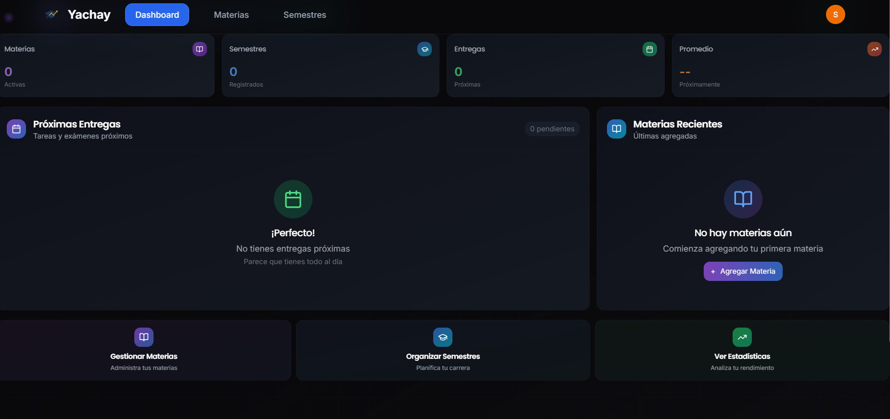
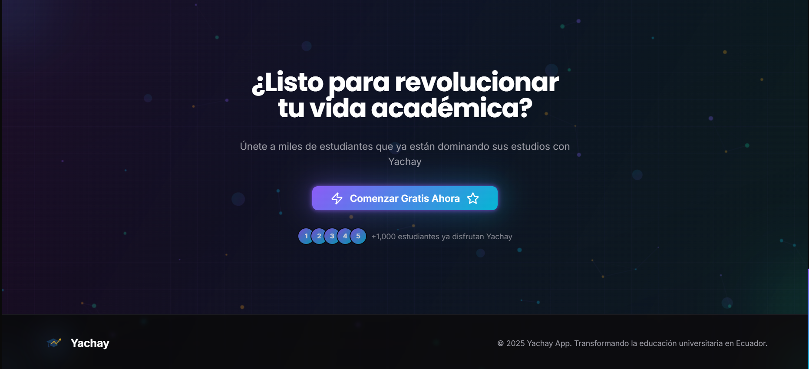

<div align="center">


#  **YACHAY APP**
### *🚀 Tu centro académico inteligente para dominar tus estudios*

[](https://yachay-79sgtq3x4-mat1520s-projects.vercel.app)
[](https://github.com/mat1520/yachay-app)
[](LICENSE)


### 🌟 **¡Revoluciona tu forma de estudiar!** 🌟

</div>

## 🎯 **¿Qué es Yachay?**

<div align="center">
<h3>🔥 <strong>La plataforma académica que necesitas</strong> 🔥</h3>

**Yachay** transforma tu experiencia universitaria en algo **extraordinario**. 
Centraliza **TODO** tu mundo académico en una sola aplicación súper intuitiva.


</div>

## ⚡ **Características Explosivas**

<div align="center">
  <table>
    <tr>
      <td align="center" width="25%">
        
        <br><h4>📅 Gestión de Semestres</h4>
        <p><em>Organiza tus periodos académicos como un pro</em></p>
      </td>
      <td align="center" width="25%">
        
        <br><h4>📚 Control de Materias</h4>
        <p><em>Administra todas tus asignaturas</em></p>
      </td>
      <td align="center" width="25%">
        
        <br><h4>✅ Tareas y Proyectos</h4>
        <p><em>Nunca más olvides una entrega</em></p>
      </td>
      <td align="center" width="25%">
        
        <br><h4>📊 Seguimiento de Notas</h4>
        <p><em>Calcula tu promedio en tiempo real</em></p>
      </td>
    </tr>
  </table>
</div>

### 🎯 **Superpoderes Académicos**

<div align="center">

| 🚀 **Característica** | 💫 **Beneficio** | 🎉 **Estado** |
|:---------------------:|:----------------:|:-------------:|
| 📊 **Dashboard Inteligente** | Vista panorámica de tu progreso | ✅ **Activo** |
| 👤 **Perfil Personalizable** | Gestiona tu información académica | ✅ **Activo** |
| ⚙️ **Configuración Flexible** | Personaliza todo a tu gusto | ✅ **Activo** |
| 🔐 **Login Súper Seguro** | Múltiples opciones de acceso | ✅ **Activo** |
| 📱 **Responsive Design** | Funciona en ANY dispositivo | ✅ **Activo** |
| 🎨 **Interfaz Moderna** | Diseño que enamora | ✅ **Activo** |

</div>

## 🔐 **Opciones de Login Increíbles**

<div align="center">

### 🌟 **¡Elige tu forma favorita de entrar!** 🌟

<table>
  <tr>
    <td align="center" width="33%">
      
      <br><h3>🔥 Google OAuth</h3>
      <p><strong>Un click y listo</strong></p>
      <a href="https://yachay-79sgtq3x4-mat1520s-projects.vercel.app/login">
        
      </a>
    </td>
    <td align="center" width="33%">
      
      <br><h3>⚡ GitHub Access</h3>
      <p><strong>Para developers</strong></p>
      <a href="https://yachay-79sgtq3x4-mat1520s-projects.vercel.app/login">
        
      </a>
    </td>
    <td align="center" width="33%">
      
      <br><h3>✨ Magic Link</h3>
      <p><strong>Solo con tu email</strong></p>
      <a href="https://yachay-79sgtq3x4-mat1520s-projects.vercel.app/login">
        
      </a>
    </td>
  </tr>
</table>

### 🎊 **¡Sin contraseñas complicadas, sin problemas!** 🎊

</div>

## 📸 **Galería Visual Increíble**

<div align="center">

### 🎨 **¡Mira qué hermoso se ve!** 🎨


</div>

<table>
  <tr>
    <td align="center" width="50%">
      <details>
        <summary><h3>🏠 <strong>Landing Page Espectacular</strong></h3></summary>
        <div align="center">
          
          <p><em>🌟 Página principal que conquista desde el primer vistazo</em></p>
        </div>
      </details>
    </td>
    <td align="center" width="50%">
      <details>
        <summary><h3>🔐 <strong>Login Super Fácil</strong></h3></summary>
        <div align="center">
          
          <p><em>⚡ Autenticación segura con múltiples opciones</em></p>
        </div>
      </details>
    </td>
  </tr>
  <tr>
    <td align="center" width="50%">
      <details>
        <summary><h3>📊 <strong>Dashboard de Ensueño</strong></h3></summary>
        <div align="center">
          
          <p><em>🚀 Panel principal que hace que estudiar sea genial</em></p>
        </div>
      </details>
    </td>
    <td align="center" width="50%">
      <details>
        <summary><h3>⚡ <strong>Características Potentes</strong></h3></summary>
        <div align="center">
          
          <p><em>💫 Funcionalidades que te harán más productivo</em></p>
        </div>
      </details>
    </td>
  </tr>
</table>

## 🛠️ **Arsenal Tecnológico de Elite**

<div align="center">


### 🎨 **Frontend Moderno**
[](https://nextjs.org/)
[](https://www.typescriptlang.org/)
[](https://tailwindcss.com/)
[](https://www.radix-ui.com/)

### 🚀 **Backend & Database Poderoso**
[](https://supabase.com/)
[](https://www.postgresql.org/)

### ☁️ **Deploy & Auth de Lujo**
[](https://vercel.com/)
[](https://developers.google.com/identity)
[](https://docs.github.com/en/apps/oauth-apps)

</div>

</div>

## 🚀 **¡PRUEBA LA MAGIA EN VIVO!**

<div align="center">


### � **¡LA APLICACIÓN ESTÁ LISTA PARA TI!** 🎊

<a href="https://yachay-79sgtq3x4-mat1520s-projects.vercel.app">
  
</a>

### � **¡Sin registro, sin complicaciones!** 💫

<table>
  <tr>
    <td align="center">
      <a href="https://yachay-79sgtq3x4-mat1520s-projects.vercel.app/login">
        
      </a>
    </td>
    <td align="center">
      <a href="https://yachay-79sgtq3x4-mat1520s-projects.vercel.app/login">
        
      </a>
    </td>
    <td align="center">
      <a href="https://yachay-79sgtq3x4-mat1520s-projects.vercel.app/login">
        
      </a>
    </td>
  </tr>
</table>

### 🎯 **¡Elige tu aventura y comienza YA!** 🎯

</div>

## 🏗️ **Instalación Local**

```bash
# Clonar el repositorio
git clone https://github.com/mat1520/yachay-app.git

# Entrar al directorio
cd yachay-app

# Instalar dependencias
npm install

# Configurar variables de entorno
cp .env.example .env.local

# Ejecutar en modo desarrollo
npm run dev
```

### 📋 **Variables de Entorno Requeridas**

```env
NEXT_PUBLIC_SUPABASE_URL=tu_supabase_url
NEXT_PUBLIC_SUPABASE_ANON_KEY=tu_supabase_anon_key
GOOGLE_CLIENT_ID=tu_google_client_id
GOOGLE_CLIENT_SECRET=tu_google_client_secret
```

## 🤝 **Contribuciones**

¡Las contribuciones son bienvenidas! Si encuentras un bug o tienes una idea para mejorar Yachay:

1. 🍴 Haz fork del proyecto
2. 🌟 Crea una rama para tu feature (`git checkout -b feature/AmazingFeature`)
3. 💾 Commit tus cambios (`git commit -m 'Add some AmazingFeature'`)
4. 📤 Push a la rama (`git push origin feature/AmazingFeature`)
5. 🔃 Abre un Pull Request

## 💰 **¡Apoya este Proyecto Increíble!**

<div align="center">


### 🌟 **¿Te gustó Yachay? ¡Ayúdame a seguir mejorándolo!** 🌟

<table>
  <tr>
    <td align="center" width="50%">
      <h3>💝 Donación</h3>
      <a href="https://www.paypal.com/paypalme/ArielMelo200?country.x=EC&locale.x=es_XC">
        
      </a>
      <p><em>🚀 Tu apoyo hace posible más features</em></p>
    </td>
    <td align="center" width="50%">
      <h3>⭐ Dale una estrella</h3>
      <a href="https://github.com/mat1520/yachay-app/stargazers">
        
      </a>
      <p><em>✨ ¡Es gratis y me motiva mucho!</em></p>
    </td>
  </tr>
</table>

### 🎊 **¡Cada granito de arena cuenta para hacer Yachay más awesome!** 🎊

</div>

## 👨‍ **Conoce al Creador**

<div align="center">


### � **Ariel Melo** - *F Developer & Student*

<table>
  <tr>
    <td align="center" width="50%">
      <h3>💬 Telegram</h3>
      <a href="https://t.me/MAT3810">
        
      </a>
      <p><em>🔥 Para preguntas rápidas y colaboraciones</em></p>
    </td>
    <td align="center" width="50%">
      <h3>🐙 GitHub</h3>
      <a href="https://github.com/mat1520">
        
      </a>
      <p><em>⚡ Más proyectos geniales aquí</em></p>
    </td>
  </tr>
</table>

### 💫 **¿Dudas, ideas, colaboraciones? ¡Escríbeme sin pena!** 💫

</div>

## 📄 **Licencia**

Este proyecto está bajo la Licencia MIT. Consulta el archivo [LICENSE](LICENSE) para más detalles.

---

<div align="center">


### 🎉 **¡GRACIAS POR LLEGAR HASTA AQUÍ!** 🎉

<table>
  <tr>
    <td align="center" width="33%">
      <h2>🎓</h2>
      <br><h3>🎓 Para Estudiantes</h3>
      <p><strong>Que nunca dejen de aprender</strong></p>
    </td>
    <td align="center" width="33%">
      <h2>👨‍🏫</h2>
      <br><h3>👨‍🏫 Para Educadores</h3>
      <p><strong>Que inspiran cada día</strong></p>
    </td>
    <td align="center" width="33%">
      <h2>👨‍💻</h2>
      <br><h3>👨‍💻 Para Developers</h3>
      <p><strong>Que construyen el futuro</strong></p>
    </td>
  </tr>
</table>

### ⭐ **¡Tu estrella es mi combustible!** ⭐

<a href="https://github.com/mat1520/yachay-app/stargazers">
  
</a>
<a href="https://github.com/mat1520/yachay-app/network/members">
  
</a>

### 💝 **Hecho con mucho ❤️ y ☕ para estudiantes de todo el mundo** 💝


<h2>🚀 ¡Que tengas un semestre ÉPICO! 🚀</h2>

</div>
